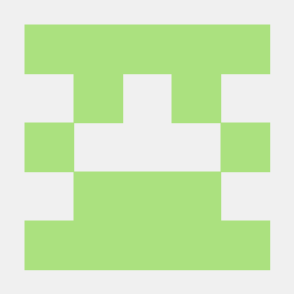
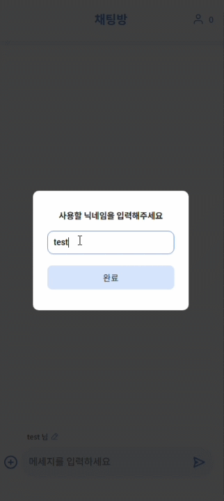
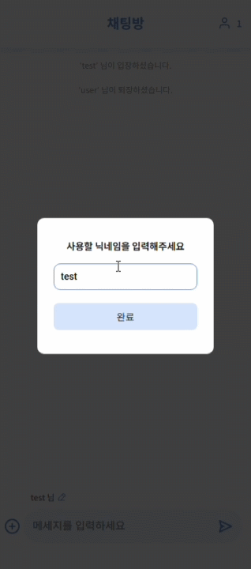
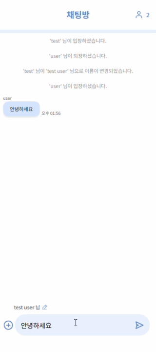
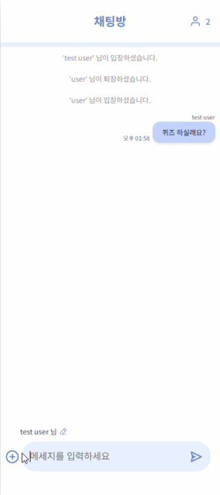
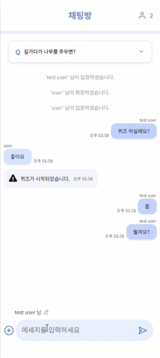
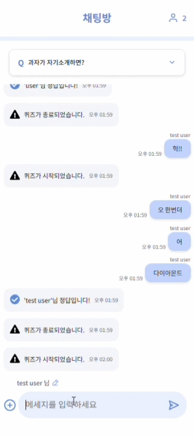
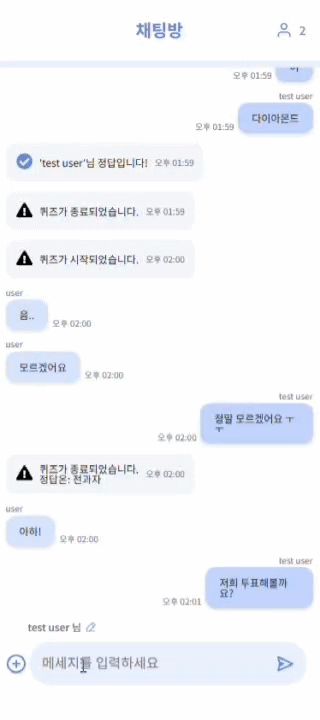
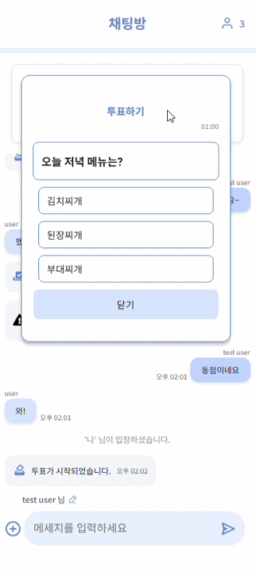

# 👩‍💻기술 스택
- 공통
  


- FE


- BE


 


# 👥 팀원 소개

## FE 

<table>
  <tr>
    <td align="center" width="450px" height="200px" valign="middle">
      
    </td>
    <td align="center" width="450px" height="200px" valign="middle">
      
    </td>
  </tr>
  <tr>
    <td align="center" height="50px" valign="middle">
      <a href="https://github.com/heeyoung123"><b>김희영</b></a>
    </td>
    <td align="center" height="50px" valign="middle">
      <a href="https://github.com/sonjiwoo1215"><b>손지우</b></a>
    </td>
  </tr>
  <tr>
    <td align="left" style="padding: 10px;">
      - 투표 UI 및 투표 시작/종료, 투표 결과 도출 로직 구현<br>
      - 채팅 시점 설정<br>
      - 헤더와 푸터 UI, 로직 구현<br>
      - 피그마 디자인
    </td>
    <td align="left" style="padding: 10px;">
      - 퀴즈 UI 구현 및 퀴즈 시작/종료, 정답 제출 흐름 구현<br>
      - 채팅 UI 구현 및 실시간 메시지 송수신 처리<br>
      - 시스템 메시지와 사용자 메시지 구분 처리 및 UI 분기 처리
    </td>
  </tr>
</table>

<br/>

## BE

<table>
  <tr>
    <td align="center" width="450px" height="200px" valign="middle">
      
    </td>
    <td align="center" width="450px" height="200px" valign="middle">
      
    </td>
  </tr>
  <tr>
    <td align="center" height="50px" valign="middle">
      <a href="https://github.com/HS-01219"><b>최희수</b></a>
    </td>
    <td align="center" height="50px" valign="middle">
      <a href="https://github.com/jo-eunchae"><b>조은채</b></a>
    </td>
  </tr>
  <tr>
    <td align="left" style="padding: 10px;">
      - 유저/퀴즈 소켓 이벤트 구현<br>
      - AWS & Docker를 이용한 배포<br>
      - FE 스크립트 오류 수정
    </td>
    <td align="left" style="padding: 10px;">
      - 메시지/투표 관련 소켓 이벤트 구현<br>
      - GitHub Action을 이용한 자동 배포
    </td>
  </tr>
</table>


# 💿 실행 방법
## 환경변수
- backend 폴더 내 .env 파일 생성
```docker
# 서버 포트 번호
PORT=YOUR_PORT_NUMBER

# DB 정보
DB_HOST=YOUR_HOST_NAME
DB_PORT=YOUR_PORT_NUMBER
DB_USER=YOUR_USER_NAME
DB_PASSWORD=YOUR_PASSWORD

# redis 정보
REDIS_HOST=YOUR_HOST_NAME
REDIS_PORT=YOUR_PORT_NUMBER
REDIS_PASSWORD=YOUR_PASSWORD

FRONT_SERVER_URL=FRONT_URL
```

- frontend 폴더 내 .env 파일 생성
```docker
VITE_BACK_SERVER_URL = BACK_URL
```    

## docker-compose를 이용한 실행
```docker
# 백그라운드에 도커 실행 후 터미널에 입력
# 이 때 docker-compose.yml에 있는 포트 번호가 
# 당신의 env 파일 포트 번호와 일치해야 합니다.
docker compose up -d --build
```

## 로컬 실행
```docker
# 터미널에서 입력
# 백엔드
cd backend
npm install
npm run build
npm run start

# 새 터미널 창 열고 입력
# 프론트엔드
cd frontend
npm install
npm run build
npm run start

# 로컬 환경에서 redis 설치 후 실행
# 브라우저에서 localhost:YOUR_PORT_NUMBER 로 접속 
```

# 📌 기능 설명
## 유저/채팅
|입장/퇴장|닉네임 변경|실시간 채팅|
|---|---|---|
||||

## 퀴즈
|시작|정답 입력|종료 버튼|
|---|---|---|
||||

## 투표
|시작|진행|종료 버튼|
|---|---|---|
||||
